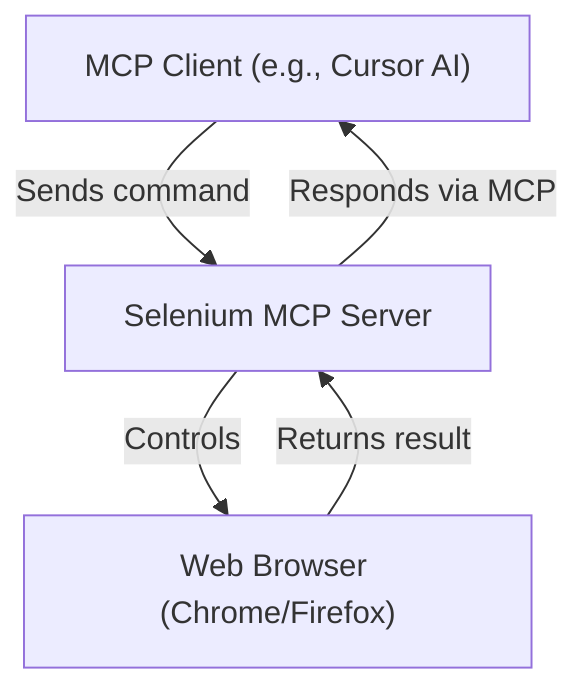

# Selenium MCP Server

[](https://github.com/krishnapollu/selenium-mcp-server/actions/workflows/ci.yml)
[](https://badge.fury.io/py/selenium-mcp-server)
[](https://pypi.org/project/selenium-mcp-server/)
[](https://pypi.org/project/selenium-mcp-server/)
[](https://pypi.org/project/selenium-mcp-server/)

A powerful Model Context Protocol (MCP) server that brings Selenium WebDriver automation to AI assistants. This server enables AI tools like Claude Desktop and Cursor AI to control web browsers programmatically, making web automation accessible through natural language commands.

---

## 📚 Table of Contents
- [Features](#-features)
- [Quick Start](#-quick-start)
- [Getting Started](#-getting-started)
- [Client Integration](#-client-integration)
- [Available Tools & Examples](#-available-tools--examples)
- [Advanced Configuration](#-advanced-configuration)
- [Environment Variables](#-environment-variables)
- [Testing Your Configuration](#-testing-your-configuration)
- [FAQ / Troubleshooting](#-faq--troubleshooting)
- [Contributing](#-contributing)
- [Changelog](#-changelog)
- [Project Structure](#project-structure)
- [License](#license)
- [Contact & Support](#contact--support)

---

## 🚀 Features
- Multi-browser support: Chrome and Firefox (headless or full mode)
- Session management: Start, list, switch, and close browser sessions
- Navigation: Go to URLs, reload, and retrieve page info
- Element interaction: Find, click, type, hover, drag-and-drop, double/right click, upload files
- Advanced actions: Execute JavaScript, take screenshots, get/set element text
- File operations: Upload files, download files, take full-page screenshots
- Robust error handling
- Easy integration with any MCP-compatible client (Cursor AI, Claude Desktop, Google Gemini, etc.)
- PEP 517/518 compliant packaging

---

## ⚡ Quick Start

```bash
pip install selenium-mcp-server
python -m selenium_mcp_server
```

Add this to your MCP client config (e.g., Cursor AI):
```json
{
  "mcpServers": {
    "selenium": {
      "command": "python",
      "args": ["-m", "selenium_mcp_server"]
    }
  }
}
```

---

## 🏁 Getting Started

1. **Install**
   ```bash
   pip install selenium-mcp-server
   ```
2. **Run the server**
   ```bash
   python -m selenium_mcp_server
   ```
3. **Connect your MCP client** (see config above)

**Windows users:** If you see a `.exe.deleteme` error, delete any `selenium-mcp-server.exe` or `.exe.deleteme` files in your Python `Scripts` directory, then retry the install. You can always run the server with `python -m selenium_mcp_server`.

---

## 🤖 Client Integration

- **Cursor AI:** `~/.cursor/mcp_config.json`
- **Claude Desktop:** `~/.config/claude-desktop/config.json` (Linux/macOS) or `%APPDATA%\claude-desktop\config.json` (Windows)
- **Other MCP Clients:** See your client's documentation

---

## 🛠️ Available Tools & Examples

### Browser Management
- **Start Browser**
  ```json
  { "browser": "chrome", "options": { "headless": true } }
  ```
- **List Sessions**
  ```json
  { "name": "list_sessions", "arguments": {} }
  ```
- **Switch Session**
  ```json
  { "session_id": "your-session-id" }
  ```
- **Close Session**
  ```json
  { "session_id": "your-session-id" }
  ```

### Navigation & Page Info
- **Navigate**
  ```json
  { "url": "https://example.com", "wait_for_load": true }
  ```
- **Get Page Info**
  ```json
  { "include_title": true, "include_url": true, "include_source": false }
  ```

### Element Interaction
- **Find Element**
  ```json
  { "by": "css", "value": "#my-element" }
  ```
- **Click Element**
  ```json
  { "by": "css", "value": "#my-button", "force_click": true }
  ```
- **Send Keys**
  ```json
  { "by": "css", "value": "#input", "text": "hello", "clear_first": true }
  ```
- **Get Element Text**
  ```json
  { "by": "css", "value": "#output" }
  ```
- **Hover**
  ```json
  { "by": "css", "value": "#hover-target" }
  ```
- **Drag and Drop**
  ```json
  { "by": "css", "value": "#source", "targetBy": "css", "targetValue": "#target" }
  ```
- **Double Click / Right Click**
  ```json
  { "by": "css", "value": "#element" }
  ```
- **Press Key**
  ```json
  { "key": "Enter" }
  ```
- **Upload File**
  ```json
  { "by": "css", "value": "input[type='file']", "filePath": "C:/Users/YourName/file.txt" }
  ```
- **Wait for Element**
  ```json
  { "by": "css", "value": "#wait-for-me", "wait_for_visible": true }
  ```

### Advanced Actions
- **Take Screenshot**
  ```json
  { "full_page": true }
  ```
- **Execute Script**
  ```json
  { "script": "return document.title;" }
  ```

---

## 📊 Example Automation Flow



---

## ⚙️ Advanced Configuration

You can configure the Selenium MCP Server in several ways:

### Option 1: Installed Package (Recommended)
```json
{
  "mcpServers": {
    "selenium": {
      "command": "python",
      "args": ["-m", "selenium_mcp_server"],
      "env": {
        "PYTHONUNBUFFERED": "1"
      }
    }
  }
}
```

### Option 2: Direct File Execution
- **Windows:**
  ```json
  {
    "mcpServers": {
      "selenium": {
        "command": "python",
        "args": ["C:\\path\\to\\selenium-mcp-server\\src\\selenium_mcp_server.py"],
        "env": {
          "PYTHONPATH": "C:\\path\\to\\selenium-mcp-server\\src",
          "PYTHONUNBUFFERED": "1"
        }
      }
    }
  }
  ```
- **macOS/Linux:**
  ```json
  {
    "mcpServers": {
      "selenium": {
        "command": "python",
        "args": ["/path/to/selenium-mcp-server/src/selenium_mcp_server.py"],
        "env": {
          "PYTHONPATH": "/path/to/selenium-mcp-server/src",
          "PYTHONUNBUFFERED": "1"
        }
      }
    }
  }
  ```

### Option 3: Console Script
```json
{
  "mcpServers": {
    "selenium": {
      "command": "selenium-mcp-server"
    }
  }
}
```

---

## 🌐 Environment Variables
- `PYTHONUNBUFFERED=1`: Ensures Python output is not buffered
- `SELENIUM_LOG_LEVEL=INFO`: Sets logging level (DEBUG, INFO, WARNING, ERROR)
- `PYTHONPATH`: Points to the directory containing the Python modules (needed for direct file execution)

---

## 🧪 Testing Your Configuration
After configuring, test with:
```json
{
  "name": "list_sessions",
  "arguments": {}
}
```
You should get an empty list if no sessions are active.

---

## ❓ FAQ / Troubleshooting

**Q: I see "0 tools enabled" in Cursor AI.**
- Make sure the package is installed: `pip install selenium-mcp-server` (or `pip install -e .` for development)
- Verify the module works:
  ```bash
  python -c "import selenium_mcp_server; print('Module found!')"
  ```
- Check if the entry point works:
  ```bash
  selenium-mcp-server --help
  ```
- Try using the console script entry point in your config.

**Q: "Module not found" errors**
- Make sure you've installed the package: `pip install selenium-mcp-server` or `pip install -e .`
- Check that the `PYTHONPATH` points to the correct directory if running from source
- Verify the file paths are correct for your system

**Q: "Command not found" errors**
- Ensure Python is in your system PATH
- Try using the full path to Python: `C:\Python312\python.exe` (Windows) or `/usr/bin/python3` (Linux/macOS)

**Q: Permission errors**
- On Windows, try running your MCP client as administrator
- On Linux/macOS, check file permissions: `chmod +x src/selenium_mcp_server.py`

**Q: I get a `.exe.deleteme` error on Windows when upgrading.**
- Close all terminals, delete any `selenium-mcp-server.exe` or `.exe.deleteme` files in your Python `Scripts` directory, and retry the install. You can always run the server with `python -m selenium_mcp_server`.

**Q: How do I check the server version?**
- The server prints its version on startup. You can also check with `pip show selenium-mcp-server`.

**Q: Can I use this with headless browsers?**
- Yes! The server supports both headless and full browser modes.

**Q: How do I contribute or report issues?**
- See the Contributing section below.

---

## 🤝 Contributing
- Fork the repo and create a feature branch
- Make your changes (see `src/selenium_mcp_server/`)
- Add/modify tests if needed
- Open a pull request with a clear description
- For issues, use the [GitHub Issues](https://github.com/krishnapollu/selenium-mcp-server/issues) tab

---

## 🗒️ Changelog
- **1.1.6**: Improved error handling, updated dependencies, enhanced Windows compatibility
- **1.1.5**: Simplified packaging, removed legacy scripts, improved docs
- **1.1.4 and earlier**: Initial releases, core MCP and Selenium features

---

## Project Structure
- All source code is in `src/selenium_mcp_server/`
- No unnecessary files or scripts in the root or src directory
- The package is fully PEP 517/518 compliant and ready for PyPI distribution

---

## License
MIT License - feel free to use this in your own projects.

---

## Contact & Support
- For questions, open a [GitHub Issue](https://github.com/krishnapollu/selenium-mcp-server/issues)
- For discussions, feature requests, or help, use the GitHub Discussions or Issues
- Maintained by [Krishna Pollu](https://github.com/krishnapollu)

---

**Note**: This server is designed for legitimate automation tasks. Please respect websites' terms of service and robots.txt files when using this tool. 